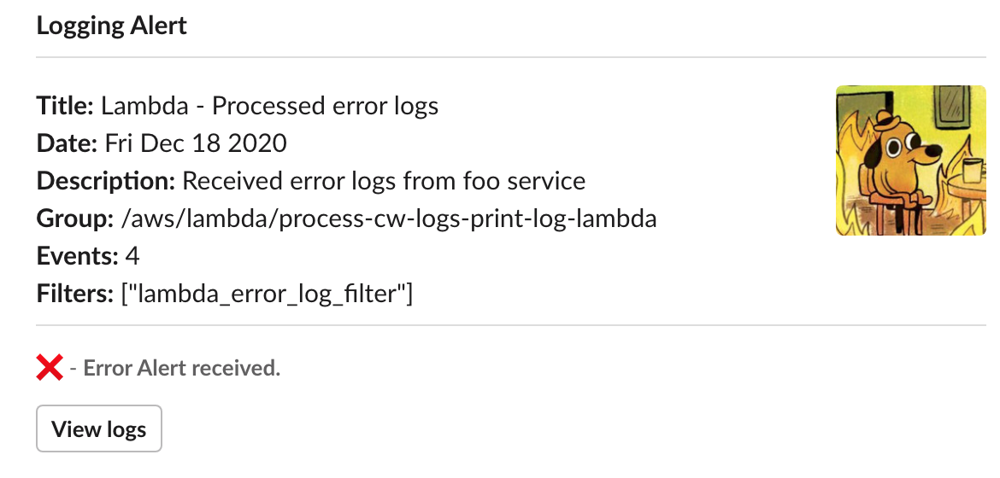

# AWS lambda process CloudWatch logs 

Create a function to process Cloudwatch logs streams to detect errors.


🚧 This is a work in progress. More instructions to come.

## Contents 

- [Introduction](#introduction)  
   - [Todo](#todo-list)
- [Quick Start](#quick-start)
- [Technologies](#technologies)
- [Notes](#notes)
- [Helpful links](#helpful-links)


## Introduction

**Create two lambda resources:**

1. For regular workloads - logs to a specific cloudwatch log group
2. For supplementary workloads - processing the logs from #1
3. Setup AWS SSM for storing senstive info (slack webhook url)
4. Setup SNS / slack notification for errors [BONUS]


### Todo list 

- [x] Scaffold infra for print log lambda and error processor lambda 
- [x] Scaffold send slack webhook alert
- [ ] Setup AWS SSM
- [ ] Setup SNS for notification channels (ex. text, slack and email)

### Sample Slack Notification




## Quick Start

TODO

**Technologies:**

- AWS Lambda
- Terraform (>= v0.12.24)
- axios (^0.21.0)
- [@speee-js/jsx-slack](https://github.com/speee/jsx-slack) (^2.6.x)

1. Add AWS secret and key to your environment (or use template below and fill in envs)

```sh

# setup-env.sh
export AWS_ACCESS_KEY_ID=<xxxx>
export AWS_SECRET_ACCESS_KEY=<xxxx>
export AWS_DEFAULT_REGION=us-east-1
export TF_VAR_s3_bucket_name=<unique-s3-bucket-name>

. ./setup-env.sh

```

## Technologies


- Node.js (12.x)
- Terraform (12.x)
- Jest (26.x)
- Typescript (3.9.7)
- rollup (1.3.x)

## Notes


#### Ensure proper Principal when defining `aws_lambda_permission`


When defining the lambda permission for CloudWatch logs to invoke functions.

Ensure the `Principal` field is correct and has the right format:

```tf
resource "aws_lambda_permission" "allow_cloudwatch_logs" {
    ...
    principal     = "logs.<aws-region>.amazonaws.com"
}
```

Otherwise, you may run into an error when running terraform:


## Helpful Links

This section contains the helpful links for this particular task / project.

#### Links

**Terraform:**  
- [Terraform, Resource: aws_cloudwatch_log_subscription_filter](https://registry.terraform.io/providers/hashicorp/aws/latest/docs/resources/cloudwatch_log_subscription_filter)  
- [Terraform, Resource: aws_cloudwatch_log_group](https://registry.terraform.io/providers/hashicorp/aws/latest/docs/resources/cloudwatch_log_group)  
- [Terraform, Resource: aws_lambda_permission](https://registry.terraform.io/providers/hashicorp/aws/latest/docs/resources/lambda_permission)  

**AWS:**  
- [AWS, Subscription filter lambda example](https://docs.aws.amazon.com/AmazonCloudWatch/latest/logs/SubscriptionFilters.html#LambdaFunctionExample)  

**Stackoverflow:**  

- [AWS Subscription Filter cloudwatch log, terraform Discussion](https://stackoverflow.com/questions/38407660/terraform-configuring-cloudwatch-log-subscription-delivery-to-lambda/38428834#38428834)
